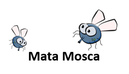

<h1 align="center">
    
</h1>

# Indice

* [Sobre](#sobre)
* [Tecnologias Utilizadas](#tecnologias-utilizadas)
* [Como Jogar](#como-jogar)

## Sobre

O jogo **Mata mosca** foi criado no curso de desenvolvimento web como forma divertida de praticar HTML, CSS, Javascript e lógica de programação.

O projeto está hospedado no Github pages e pode ser acessado através do link abaixo.

<h3 align="center">
    <a href="https://cleidson-oliveira.github.io/game-mata-mosca">Acessar a demonstração</a>
<h3 >

---

## Tecnologias utilizadas

O projeto foi desenvolvido utilizando as seguintes tecnologias

- [HTML](https://developer.mozilla.org/pt-BR/docs/Web/HTML)
- [CSS](https://developer.mozilla.org/pt-BR/docs/Web/CSS)
- [Javascript](https://developer.mozilla.org/pt-BR/docs/Web/JavaScript)   
    
---

## Como Jogar

- Na página inicial do jogo escolha o nível e clique start para iniciar a partida.
- Clique sobre as moscas para mata-las e somar pontos.
- Caso demore para matar a mosca ela troca de lugar e você perde uma vida.
- O nível escolhido influencia a velocidade com que a mosca troca de lugar.
- Após perder 3 vidas você perde a partida.
- Mate o maior número possível para somar mais pontos.

Desenvolvido por [Cleidson Oliveira](https://github.com/Cleidson-Oliveira)
